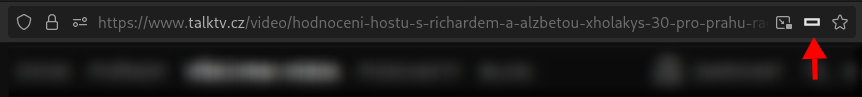
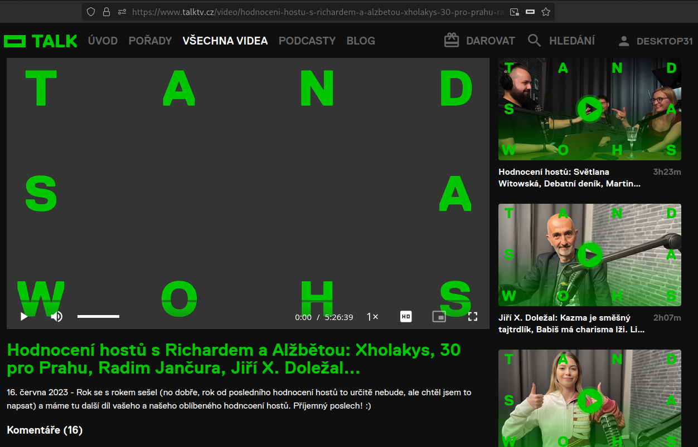
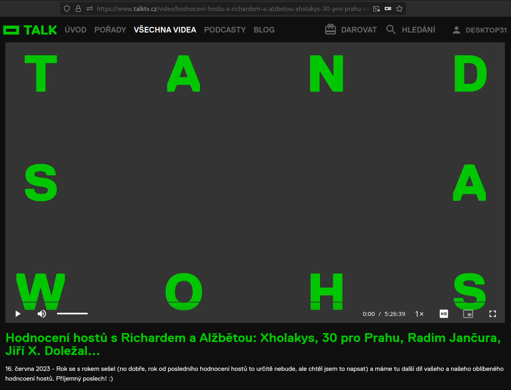

# TALK-THEATRE
A Firefox extension that adds theatre mode to videos on [talktv.cz](https://www.talktv.cz)

## How to activate
Click this icon on the right side of the url bar.

## Preview

### Before

### After

## Bugs
- The button acts sometimes a bit goofy

## Credits
This extension is a slightly modified [apply-css example](https://github.com/mdn/webextensions-examples/tree/main/apply-css) from the MDN github page.

